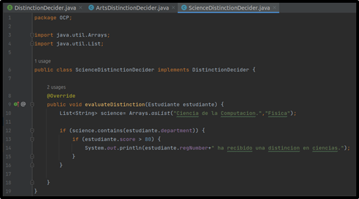

# PC3-Software #

## Principio de responsabilidad única ##
- Pregunta 1	

Muestra la salida y explica los resultados en función de los métodos entregados

>

>Observamos que tenemos dos clases: Cliente y Empleado. Al correr el código, el flujo del programa inicia en el método *main* de la clase Cliente, el cual primero imprime un mensaje en pantalla y, a continuación, instancia un objeto de la clase **Empleado (el constructor recibe como parámetros el nombre, apellido y años de experiencia del empleado). Después, se llama al método *showEmpDetail* de la clase Cliente. Dicho método recibe como parámetro al objeto previamente instanciado de la clase Empleado y, además, será el encargado de llamar al resto de métodos de esta clase. Primero llama al método *displayEmpDetail* (método encargado de imprimir en pantalla el nombre y años de experiencia del empleado) y luego, al imprimir en pantalla el ID y rango del empleado, hace un llamado a los métodos *checkSeniority* y *generateEmpId*, los cuales reciben como parámetros un número y una cadena de texto respectivamente (no necesariamente los atributos previamente definidos en el constructor de la clase Empleado). Luego, se imprime en pantalla un espacio en blanco y se procede a instanciar un nuevo objeto de la clase Empleado. Una vez más, se llama al método *showEmpDetail* y el proceso anteriormente descrito se repite.

- Pregunta 2

¿Cuál es el problema con este diseño y las razones posibles del problema?

>El gran problema del diseño actual es que no cumple con el **principio de responsabilidad única** de SOLID. Tenemos a la clase Empleado que se encuentra realizando más de una función; tenemos 3 métodos dentro de esta clase y cada uno de ellos tiene un propósito distinto. Al parecer la razón detrás de esto es que el desarrollador buscó contener en una sola clase todas las funcionalidades que requería su aplicación (con el fin de que todo el código se encuentre solo en dos clases); más olvido que tomando dicha decisión podría pasar factura, por ejemplo, en temas de *escalabilidad*. Si en un futuro el código de dicha aplicación creciese, y se hiciese necesario el que los métodos de la actual clase Empleado puedan exportar sus resultados a diversos formatos (no solo imprimir mensajes en consola), se tendría que realizar varias modificaciones a la clase; esto a todas luces no es óptimo, por lo que lo recomendable sería refactorizar la clase ahora que el código no es grande.

>Dentro de la clase Cliente también nos encontramos con algo “innecesario”. Se está declarando un método (*showEmpDetail*) encargado de llamar a varios métodos de la clase Empleado. Esto podría obviarse y realizar el llamado a dichos métodos desde el propio método *main* .


- Pregunta 3

Modifica la clase Empleado. Agrega dos clases SeniorityChecker que contiene el método checkSeniority() y la clase GeneradorIDEmpleado contiene el método
generateEmpId(...) para generar la identificación del empleado. Para mejorar la legibilidad del código y evitar torpezas dentro del método main(), utiliza el método estático showEmpDetail(...). Este método llama al método displayEmpDetail() de Empleado, al método generateEmpId() de GeneradorIDEmpleado y al método checkSeniority() de SeniorityChecker. Tú entiendes que este método no era necesario, pero hace que el código del cliente sea simple y fácilmente comprensible.

>Clase Cliente:

>

>Clase Empleado:

>

>Clase GeneradorIDEmpleado:

>

>Clase SeniorityChecker:

>

>Dentro de la clase Empleado, se removieron los métodos generateEmpId y checkSeniority (con el fin de cumplir con el principio de responsabilidad única).

>Se crearon las clases *GeneradorIDEmpleado* y *SeniorityChecker*, las cuales tienen un único método (generateEmpId y checkSeniority respectivamente). Dichos métodos fueron declarados como estáticos con el fin que puedan ser llamados sin necesidad de instanciar un objeto de la clase a la que pertenecen.

>En el método showEmpDetail de la clase Cliente, se cambió el llamado a los antiguos métodos de la clase Empleado por los nuevos métodos de las clases recién creadas.

- Pregunta 4

Realiza una demostración completa que sigue a SRP. Explica tus resultados

>

>Como se puede observar, los resultados no han variado; pero lo que si ha cambiado es el diseño de este código, el cual ahora cumple con el principio de responsabilidad única. Cada una de las clases presentes solo tienen un único método, el cual a su vez solo cumplen una función y no más. 

>La clase Empleado tiene un método *displayEmpDetail*, el cual solo se encarga de mostrarnos en pantalla el nombre del Empleado y la cantidad de años de experiencia que este tiene.

>La clase GeneradorIDEmpleado solo cuenta con el método *generateEmpId*, el cual se encarga de crear un código aleatorio; código que luego es mostrado en pantalla cuando el presente método es llamado.

>La clase SeniorityChecker tiene como único método a *checkSeniority*, encargada de, en base al parámetro que recibe, retornar una cadena indicando un rango. Esto último será también mostrado en pantalla cuando dicho método sea llamado.

>Por último, la clase Cliente tiene los métodos *main* y *showEmpDetail* (este último no es realmente necesario y solo es usado para facilitar la comprensión del código). Dentro del método main es donde se hacen los llamados al resto de clases-métodos. De esta forma, se evidencia que cada clase tiene un solo propósito, por lo que queda demostrado el cumplimiento de SRP. Es importante recordar que, tal y como fue mencionado en una pregunta anterior, el diseñar nuestro código de esta forma nos puede ayudar a que nuestro software sea escalable. De ser necesario modificar alguna característica o realizar un pequeño cambio, solo será necesario afectar a un método perteneciente a una clase en específico; y evitar, por el contrario, tener que cambiar completamente una gran clase o incluso tener que refactorizar todo el software.

## Principio abierto/cerrado ##

- Pregunta 5

¿Por que no es correcto colocar displayResult() y evaluateDistinction() en la misma
clase, como la siguiente:

```
class Estudiante {
    // ....
    public void displayResult() {
        // codigo
    }
    public void evaluateDistinction() {
        // codigo
    }
    // ...
}
```

>En base a lo aprendido sobre el principio de responsabilidad única; al nosotros agregar dos métodos con funcionalidades distintas a la clase Empleado (clase que ya cuenta con el método toString), nos encontraríamos en un escenario donde estaríamos quebrantando dicho principio. Además, con el fin de aplicar a nuestro diseño el principio de Abierto/Cerrado, debemos considerar la importancia de previamente cumplir con SRP. Tener un código abierto a extensión y su vez cerrado a modificación, se basa en que nuestras clases tengan una única responsabilidad; así podremos añadir nuevas funcionalidades sin tener que estar afectando al código ya existente.

- Pregunta 6

Muestra la salida y explica los resultados en función de los métodos entregados

>

>El flujo de nuestro programa inicia en el método *main ()* de nuestra clase Cliente. Lo primero que hace es mostrar un mensaje en pantalla indicando que se realizará una demostración sin implementar el principio abierto/cerrado. Acto seguido, se declara una lista de objetos de tipo Estudiante, llamado *enrolledStudents*. Esta lista se obtiene al llamar el método estático *enrollStudents* (del tipo lista de estudiantes) de la clase Cliente. Dentro de este método se instancian objetos de la clase Estudiante, proporcionando los parámetros requeridos por el constructor de esta (nombre, número de registro, puntaje y departamento) y, posteriormente, se declara una lista de objetos “estudiante”, la cual será previamente llenada con los objetos que acabamos de instanciar, para finalmente ser retornada por el método actualmente descrito.

>Siguiendo con el flujo principal del programa, se mostrará en pantalla los datos de cada uno de los estudiantes generados dentro del método *enrollStudents*. Esto es realizado mediante un *for*, el cual llamará al método *toString* (a partir del uso de un *system.out.printnl*) de cada uno de los objetos creados a partir de la clase Estudiante.

>Finalmente, se instancia un objeto de la clase *DistinctionDecider*, llamado distintionDecider. La clase en mención cuenta con un método *evaluateDistinction*, el cual dependiendo del estudiante que le hayamos pasado como parámetro, nos imprimirá en pantalla si dicho estudiante ha recibido una mención en artes o ciencias. De vuelta en el flujo principal de nuestro programa, nuevamente mediante un *for** se iterará a través de los elementos de la lista *enrolledStudents* y, por cada uno de estos elementos, se llamará al método *evaluateDistinction* de distintionDecider, el cual recibirá como parámetro dicho elemento. De esta forma, podremos leer en pantalla el número de registro de los estudiantes que hayan recibido una mención, ya sea en artes o ciencias.

- Pregunta 7

¿Cuál es el problema con este diseño y las razones posibles del problema?

>Basándonos en el diseño actual de la clase Estudiante, si nosotros quisiésemos, por ejemplo, añadir nuevos métodos específicos para los estudiantes del departamento de Física, tendríamos que modificar la clase; y si ahora necesitásemos añadir métodos para los estudiantes de Inglés, tendríamos que volver a realizar una modificación en la clase Estudiante. Claramente estamos violando el principio de abierto/cerrado, puesto que si bien nuestro código es abierto a extensión (añadir nuevas funcionalidades-métodos), debería permanecer cerrado a modificación; en otras palabras, no deberíamos tener la necesidad de cambiar el código ya existente de la clase Estudiante (la cual contiene a los estudiantes de 4 departamentos distintos).

>De manera similar al caso anterior (respecto a SRP), probablemente el autor del código buscó simplificar el número de clases creadas agrupando a todos los estudiantes por su una característica general (son estudiantes), y no por algo quizás un poco más específico, pero necesario, como el hecho de que pueden pertenecer a cuatro departamentos distintos y que el flujo del programa depende mucho de esto.

>A continuación, se muestran imágenes de las modificaciones en e archivo **Estudiante.java** y la creación de **CienciaEstudiante.java** y **ArteEstudiante.java**.

>

>

>

- Pregunta 8

Debes abordar el método de evaluación para la distinción de una mejor manera. Por lo tanto, crea la interfaz DistinctionDecider que contiene un método llamado EvaluationDistinction.

>

>Se puede apreciar la interfaz DistintionDecider que ha sido creada. Se le añadió el método evaluateDistinction según las directrices de la pregunta. Dicho método será del tipo void y recibirá como parámetro un objeto de la clase Estudiante.

- Pregunta 9

Completa el código de ArtsDistinctionDecider y ScienceDistinctionDecider que implementan esta interfaz y sobreescriben el método de evaluateDistinction(...) para
especificar los criterios de evaluación según sus necesidades. De esta forma, los criterios de distinción específicos de flujo se envuelven en una unidad independiente.

>

>

>Se presentan capturas las clases **ArtsDistinctionDecider.java** y **ScienceDistinctionDecider.java**. A cada una de ellas se les implementa un método *evaluateDistinction*, previamente declarado en la interfaz DistinctionDecider. Debido que evaluateDistinction acepta un objeto “Estudiante” como parámetro, también puede aceptar a sus objetos hijos como CienciaEstudiante y ArteEstudiante (polimorfismo).

- Pregunta 10

Realiza una demostración completa que sigue a OCP. Explica tus resultados

>La clase Estudiante crea objetos de la clase estudiante

> 

> Las clases ArteEstudiante y CienciaEstudiante extienden de la clase abstracta Estudiante. Aquí se puede ver un posible uso de OCP, pues simplemente se crearía nuevas clases que extiendan de Estudiante

>

>

>Se crea la interfaz DistinctionDecider con la firma del método evaluateDistinction que va a recibir como parámetro un objeto de la clase Estudiante

>

>Las clases ScienceDistinctionDecider y ArtsDistinctionDecider implementan la interfaz DistinctionDecider y su método evaluateDistinction, usan este método para evaluar el departamento al cual corresponde el estudiante

>

>

>En la clase Cliente que sigue el OCP se puede observar que se crean diferentes listas para los diferentes tipos de estudiante, esto hace que la lógica del programa sea más escalable y más entendible

>

>

>Este sería el output siguiendo el principio de Open Close

>

- Pregunta 11

¿Cuáles son las principales ventajas ahora?

>Las principales ventajas se muestran, por ejemplo, cuando se desee añadir otro tipo de estudiante (Deportes), en ese caso se debería modificar la clase DistinctionDecider y su método evaluateDistinction lo que conllevaría a no cumplir con el principio de OPEN/CLOSE, puesto que debería estar cerrado a modificación. Por otro lado, si creamos otra clase llamada SportStudent solo deberíamos extenderla de la clase abstracta Student y no modificar la clase ya escrita, lo mismo aplicaría para las clases que implementan la interfaz DistinctionDecider.


## Principio de sustitución de Liskov ##

- Pregunta 12

Muestra la salida y explica los resultados en función de los métodos entregados

>Cuando se corre tal y como fue entregado ocurre un error, pues la clase GuestUserPayment esta vacia

>

> Sin embargo, si comentamos momentáneamente esa parte podemos observar:

>

>La manera como está estructurado este ejemplo sin LSP es:

> Existe una Interfaz Payment con las firmas de los métodos previousPaymentInfo y newPayment; esta interfaz es implementada en las clases RegisteredUserPayment y GuestUserPayment que hacen referencia a un tipo de usuario dentro del banco ficticio y también está la clase PaymentHelper que crea una lista de Payment, donde se puede añadir objetos de las clases que implementan esta interfaz (RegisteredUserPayment y GuestUserPayment) y serviría como un cajero o registro de operaciones y por ultimo tenemos la clase Cliente donde se puede ver la demostración sin LSP donde se instancia un objeto de tipo PaymentHelper, se crean dos objetos de la clase RegisteredUserPayment, se añaden estos a helper (PaymentHelper) y se ejecutan los métodos de showPreviousPayments y processNewPayments (ambos de estos métodos iteran sobre los antiguos o actuales pagos de los objetos que usan la interfaz Payment)


- Pregunta 13

Ahora supongamos que tienes un nuevo requisito que dice que necesitas admitir usuarios invitados en el futuro. Puedes procesar la solicitud de pago de un usuario invitado, pero no muestra su último detalle de pago. Entonces, crea la siguiente clase que implementa la interfaz de pago de la siguiente manera:

```
class GuestUserPayment implements Payment {
    String name;
    public GuestUserPayment() {
        this.name = "guest";
    }
    @Override
    public void previousPaymentInfo(){
        throw new UnsupportedOperationException();
    }
    @Override
    public void newPayment(){
        System.out.println("Procesando de "+name+ "pago actual
                request.");
    }
}

```
>Una vez completada la clase GuestUserPayment y descomentado la clase Cliente se puede observar que obtenemos una UnsupportedOperationException y esto debido a que el método previousPaymentInfo de la clase GuestUserPayment arroja esa este tipo de Exception

>

- Pregunta 14

Dentro del método main(), utilizas una instancia de usuario invitado e intentas usar su clase auxiliar de la misma manera,¿ qué tipo de excepción te encuentras?¿Cuál es la solución?

>Tal como explique en la pregunta 13 nos encontramos con una Exception de tipo UnsupportedOperationException; la solución sería emular lo que hace la otra clase que implementa la interfaz Payment (RegisteredUserPayment) para el método previousPaymentInfo y sería cambiar el cuerpo:

>

>Por un comentario que diga que no se puede mostrar los pagos anteriores pues es un usuario invitado

>

- Pregunta 15

Todo lo anterior Lo más importante es que viola el OCP cada vez que modifica una clase existente que usa esta cadena if-else. Entonces, busquemos una mejor solución.

>Un caso que viola OCP es en la clase main 

>

>Se podrían reemplazar RegisteredUserPayment y GuestUserPayment por la interfaz Payment, se realiza este cambio con la finalidad de que la interfaz Payment no se modifique y que solo se pueda extender para crear nuevas clases

>

>

- Pregunta 16

En el próximo programa, eliminaremos el método newPayment() de la interfaz de payment. Coloca este método en otra interfaz llamada NewPayment. Como resultado, ahora tienes dos interfaces con las operaciones específicas. Dado que todos los tipos de usuarios pueden generar una nueva solicitud de pago, las clases concretas de RegisteredUserPayment y GuestUserPayment implementan la interfaz NewPayment.

```
interface PreviousPayment {
    void previousPaymentInfo();
}
interface NewPayment {
    void newPayment();
}

```

>Creamos las interfaces PreviousPayment y NewPayment

>

>

> Completamos las clases RegisteredUserPayment y GuestUserPayment implementando las interfaces necesarias
>
>

>

> A la hora de completar la clase PayementHelper hacemos hincapié en crear las listas y métodos del tipo deseado (Interfaces NewPayment y PreviousPayment) y así poder incluir y cumplir con el principio LSP
>
>

> A la hora de completar la clase PayementHelper hacemos hincapié en crear las listas y métodos del tipo deseado (Interfaces NewPayment y PreviousPayment) y así poder incluir y cumplir con el principio LSP

>

>


- Pregunta 17

¿Cuáles son los cambios clave?

>Los cambios clave fueron separar los métodos previousPaymentInfo newPayment de la interfaz, esto porque la lógica indicaba que los objetos de la clase GuestUserPayment no debian usar el método previousPaymentInfo.

>Al separar la interfaz Payment en dos interfaces nuevas (NewPayment y PreviousPayment) doy más independencia, escalabilidad y minimizo los posibles errores en el futuro 

- Pregunta 18

Ten que aquí el enfoque clave estaba en el principio LSP, nada más. Podrías refactorizar fácilmente el código del cliente usando algún método estático. Por ejemplo realiza una modificación donde utilizas un método estático para mostrar todas las solicitudes de pago y utilizar este método siempre que lo necesites.

>La posible inclusión del método showEveryPayment que muestra los pagos ya registrados y los que serán registrados

>

>


## Principio de segregación de interfaz ##

- Pregunta 19

¿Por qué un usuario necesita cambiar una clase base (o una interfaz)? Para responder a esto, supongamos que deseas mostrar qué tipo de fax está utilizando en una fase de desarrollo posterior. Tú sabes que existen diferentes variaciones de métodos de fax, como LanFax, InternetFax (o EFax) y AnalogFax. Entonces, antes, el método SendFax() no usaba ningún parámetro, pero ahora necesita aceptar un parámetro para mostrar el tipo de fax que usa. Escribe una jerarquía de fax que puede parecerse a la siguiente:

```
interface Fax {
    // codigo
}
class LanFax implements Fax {
    @Override
    // codigo
}
class EFax implements Fax {
    @Override
    // codigo
}

```
>  Al ejecutar el programa, visualizamos que todo esta correcto a primera instancia, pero nos damos cuenta que la línea 13 esta comentada, es decir, que el usuario impresora básica no esta usando el *método sendfax()* , el cual tiene sentido, porque la impresora básica solo puede imprimir documentos, mas no enviar fax, pero esto no la hace ajena a cualquier cambio que se quiera realzar en el método, ya que si se realiza un cambio en el *método sendfax()* en *ImpresoraAvanzada* obliga a que la interfaz impresora a cambiar lo que a su vez obliga a *ImpresoraBasica* a realizar tambien el cambio, esto es un claro ejemplo de que no se esta cumpliendo el *principio de segregación de interfaz*, el cual consite en que un cliente no debe depender de un método que no utiliza.

> 

> Entonces debido a que el usuario impresora básica no puede enviar fax y al querer hacer uso del *método sendfax()* observamos una excepción. Tal como se muestra en la siguiente imagen:

> 

> Ahora yendo al contexto que nos da el problema, si queremos mostrar el tipo de fax que esta utilizando el usuario debemos agregar un parámetro al *método sendFax()*, esto causaría el mismo problema que habíamos dado al inicio, ya que al agregar el parámetro al *método senFax()* en *ImpresoraAvanzada* obliga a realizar dichos cambios tanto a la interfaz impresora como a *ImpresoraBasica*, a pesar que el usuario impresora básica no usa dicho método, es decir, que no se esta cumpliendo el ISP.

> Debido a estas situaciones es que el usuario necesita cambiar una interfaz, ya que el no cumplir con el **principio de segregación de interfaz** nos puede causar muchos problemas potenciales en el futuro, por ello este principio nos sugiere que diseñemos nuestra interfaz con los métodos adecuados que un cliente en particular pueda necesitar y de esta manera nos ahorraríamos todos esos cambios innecesarios que causa el no cumplir con el ISP.

> Por último, mostramos la jerarquía de fax que se implementó.

> 


- Pregunta 20

Para usar esta jerarquía de herencia, una vez que modificas el método sendFax() a sendFax(Fax faxType) en la clase ImpresoraAvanzada, exige que cambies la interfaz de Impresora (sí, aquí también rompe el OCP). Cuando actualices Impresora, también debes actualizar la clase impresoraBasica para adaptarse a este cambio. ¡Ahora ves el problema!. Explica el problema.

> Tenemos implementada la jerarquía de fax ( el cuál se mostró en la pregunta anterior), para poder usarla tenemos que modificar el método *sendFax()* a *sendFax( Fax faxType)* en la clase ImpresoraAvanzada, el cual recibirá como parámetro un objeto de la clase Fax para poder mostrar el tipo de fax que utiliza nuestra impresora avanzada.

> 

> El realizar dicho cambio nos obliga a la vez cambiar la interfaz *Impresora* como la clase *ImpresoraBasica*, ahora nuestro método *sendFax()* pasará a *sendFax( Fax faxType)*, esto a pesar de que nuestra clase *ImpresoraBasica* nunca llegará a usar este método, ya que las impresoras básicas no pueden enviar fax.

> 

>  En el programa podemos observar que se instanció el objeto efax de la clase Efax(), el cual es el parámetro para nuestro método sendFax, esto nos mostrará el tipo de fax que nuestra impresora avanzada utiliza.

> 

> Todo este problema es a causa de no cumplir con el **principio de segregación de interfaz** , ya que la clase ImpresoraBasica depende del método sendFax el cual nunca llegará a usar,  pero el cual sí usa la clase ImpresoraAvanzada, es decir, la clase ImpresoraBasica estará siendo afectada por los cambios que fuerce la clase ImpresoraAvanzada en la interfaz Impresora.

- Pregunta 21

Si has entendido correctamente el problema. El ISP te sugiere que te ocupes de este tipo de escenario. Explica tu respuesta.

>  El ISP nos dice que no debemos obligar a las clases a implementar métodos que no utilizan. El principal problema es que usamos una intefaz muy general en lugar de interfaces específicas, para resolver este problema, tenemos que segregar la interfaz en dos interfaces diferentes y asi poder definir la clase ImpresoraBasica sin dependencia de ningún método que nunca usará, de esta manera se estaría cumpliendo con el principio de segregación de interfaz.

```
interface Document {
    void printDocument();
}

interface Fax {
    void sendFax();
}
```

- Pregunta 22

¿Es conveniente usar e inicializar el siguiente código?

```
interface Impresora {
    void printDocument();
    void sendFax();
}
```
> Hemos podido notar con las preguntas anteriores los problemas que nos causa usar el código dado, pues no se esta cumpliendo el principio de segregación de interfaz. Al no cumplir con este principio forzamos a ImpresoraBasica a depender del método sendFax() el cual nunca usará.

- Pregunta 23

Si comienzas tu codificación considerando las impresoras avanzadas que pueden imprimir y enviar un fax, está bien. Pero en una etapa posterior, si tu programa también necesita admitir impresoras básicas,¿ qué código puedes escribir?,

> Podemos lanzar una excepción para indicar que la operación solicitada no es compatible, de esta manera el usuario sabrá que hay un error en tiempo de ejecución.

> 

> Tambien podriamos enviar un mensaje informando que la impresora no puede enviar fax, pero esto seria una contradicción o mejor dicho algo absurdo, pues es como tener un botón en nuestra impresora y que no realice absolutamente nada.

> 

> Con lo escrito anteriormente, podríamos inferir otro código, el de que no realice absolutamente nada, es decir un método vacío.

> 

- Pregunta 24

Comprueba tus respuestas añadiendo dentro de main(), el siguiente código polimórfico:

```
Impresora impresora = new ImpresoraAvanzada();
impresora.printDocument();
        impresora.sendFax();
        impresora = new ImpresoraBasica();
        impresora.printDocument();
//impresora .sendFax();
```
Además, no puedes escribir algo como

```
List<Impresora> impresoras = new ArrayList<Impresora>();
impresoras.add(new ImpresoraAvanzada());
impresoras.add(new ImpresoraBasica());
for (Impresora dispositivo : impresoras) { 
    dispositivo.printDocument();
    // dispositivo.sendFax();
}
```

En ambos casos, verás excepciones de tiempo de ejecución.

> Para el primer código : Coprobamos nuestras respuestas en los tres casos dados como respuesta (las imágenes) en la anterior pregunta.

> Para el segundo código:

> - En el primer caso : La excepción 

> 

> Observamos que efectivamente en ambos códigos hay excepciones de tiempo de ejecución.

> - En el segundo caso : El mensaje

> 

> Observamos que efectivamente en ambos códigos nos lanza el mismo mensaje.

> - En el primer caso : El método vacío 

> 

> Observamos que efectivamente en ambos códigos no nos muestra nada.

- Pregunta 25

Reemplaza el segmento de código

```
for (Impresora dispositivo : impresoras) { .printDocument();
    // dispositivo.sendFax();
}
```

con una expresión lambda adecuada.

> 

- Pregunta 26

Muestra la salida y explica los resultados en función de los métodos entregados.

> 

>  Visualizamos que para una impresora avanzada que llama al método **sendFax** y **printDocument** cumple su respectiva función sin ningún inconveniente. Pero que para una impresora básica que llama al método **sendFax** y **printDocument** solo cumple la función de imprimir documentos, pues como sabemos este tipo de impresora no puede enviar fax, por lo tanto, cuando se llama al método sendFax se lanza una excepción.

- Pregunta 27

Supongamos que necesitas admitir otra impresora que pueda imprimir, enviar faxes y fotocopiar. En este caso, si agregas un método de fotocopiado en la interfaz Impresora, los dos clientes existentes, ImpresoraBasica y ImpresoraAvanzada, deben adaptarse al cambio.

> La interfaz DispositivoFax tiene un método sendFax, el cual se encarga de enviar fax.

>

> La interfaz Impresora tiene un método printDocument, el cual se encarga de imprimir documentos.

> 

> La clase ImpresoraAvanzada implementa tanto la interfaz DispositivoFax como la interfaz Impresora, debido a que la impresora avanzada puede imprimir documentos como enviar fax.

> 

> La clase ImpresoraBásica implementa solo la interfaz Impresora, debido a que la impresora báisca solo puede imprimir documentos mas no enviar fax.

> 

> Por último la clase Cliente, el cual al ejecutar el programa visualizamos la salida, el cual confirma lo que hemos mencionado, la impresora básica imprime documento y la impresora avanzada imprime documento y envia fax.

> 

- Pregunta 28

¿Qué sucede si usa un método predeterminado dentro de la interfaz?
>Si se quiere usar un método de una interfaz, hay varias cosas que se tiene que tener en cuenta. La primera que las interfaces son abstractas y al serlos. Sus métodos no están definidos. Es por este motivo que no se puede crear un objeto del tipo interfaz.

> 
- Pregunta 29

¿Qué sucede si proporcionas un método de fax predeterminado en una interfaz?. Viste el problema potencial con esto!
>Cuando se quiere definir un método en la interfaz el programa no te lo permite debido a que estas en un interfaz y si es que por algún error al momento de compilar el programa te permite hacerlo se crearía mas problemas ya que cuando se extienden las interfaces, estos métodos son definidos otra vez.

> 

- Pregunta 30

¿Qué sucede si usa un método vacío, en lugar de lanzar la excepción?

> 
> 
> Si se usa un metodo vacío estamos entramos en conflicto con el mismo principio que dice: "UNA CLASE NO DEBE SER FORZADA A IMPLEMENTAR UNA INTERFAZ QUE NO USA, NI DEBE SER FORZADA A DEPENDER DE METODOS QUE NO USAN" y si usamos el método vacío, en lugar de lanzar la excepción, podriamos hacer que el codigo caiga en smelly code pues el metodo vacio no ayudaria a una posible mejora del codigo
## Principio de inversión de dependencia ##

- Pregunta 31

Muestra la salida y explica los resultados en función de los métodos entregados

> 

>En la foto se puede observar que se tiene 3 clases: Cliente, InterfazUsuario, Oracle Database. Cuando la clase Cliente(la cual contiene el método main) es ejecutada, lo primero que hace es imprimir un mensaje en la pantalla, luego instancia un objeto de la clase InterfazUsuario.

> 

> Una vez inicializado este objeto se decide llamar a un método este mismo. Este método es saveEmployeeId, este método recibe como parámetro un string que representa el numero de ID de cada empleado. Si pasamos a inspeccionar la clase InterfazUsuario, se observa que el parámetro, es usado otra vez por un método de un objeto de la clase OracleDatabase.

> 

>  En esta ultima clase se ve que método llamado imprime un mensaje simulando el ingreso del ID del trabajador en la base de datos.
- Pregunta 32

El programa es simple, pero ¿qué tipo de problemas presenta?

>Este programa tiene un gran problema y es que no respeta el Principio de inversión de dependencia de la metodología SOLID. Se tiene a la clase InterfazUsuario la cual instancia a un objeto de la clase OracleDatabase, esto es un incumplimiento de la siguiente regla:
•	Los módulos de alto nivel no deberían depender de los módulos de bajo nivel. Ambos deberían depender de abstracciones
La clase InterfazUsuario depende de OracleDatabase.

> 

- Pregunta 33


En el programa de la carpeta SOLID, para el caso DIP verás la siguiente jerarquía:

> 

>En el caso de la implementación de la clase InterfazUsuario se tuvo que hacer dos veces, esto posiblemente sea mi caso único. En la primera implementación se opto por crear dos métodos, cada uno encargándose de enviar el Id a la base de datos. Pero luego de ver las sugerencias en las siguientes preguntas se decidio crear métodos que asignaran las bases de datos y un método general al cual envia el código de empleado una vez ya definida la base de datos.
BaseDatos.java


- Pregunta 34

Completa todos los archivos siguientes de la sección SOLID

> 

> 

> 

> 

> 

- Pregunta 35

Encuentra alguna excepción a esta sugerencia.

>El Principio de inversión de dependencia soy muy útiles y necesarios cuando se trabajan con proyectos grandes, complejos, y flexibles. Pero en el caso de proyectos de menor escala no es necesario hacer todo 100% flexible, ya que el tiempo que se invierte aplicando la abstracción se podría usar para el desarrollo de otras clases, además de que ni siquiera llegara a ser beneficioso. Claro esta que significa que deba aplicarse esta regla todo el tiempo, pero esa depende de cada desarrollador.

- Pregunta 36

El constructor de la clase InterfazUsuario acepta un parámetro de base de datos. Proporciona una instalación adicional a un usuario cuando utiliza tanto el constructor como el método setter (setDatabase) dentro de esta clase. ¿Cuál es el beneficio?.

>Cuando se realiza la creación de otro constructor de Interfaz usuario esta clase puede ser simplificada( al menos en mi caso especifico) ya que yo tenia 2 métodos los cuales añadían el id de empleado a la base de datos cada uno. Pero una vez creado el constructor y el método de cambiar base de datos, se puede eliminar estos métodos y crear un método general al cual se llamara saveEmployee

> 
